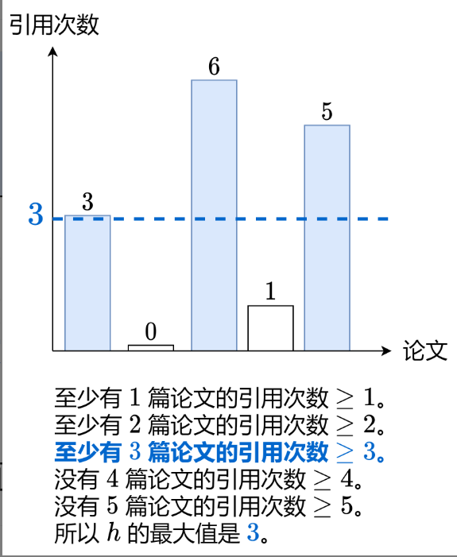

- [274. H 指数](https://leetcode.cn/problems/h-index/)

题目描述

```markdown
给你一个整数数组 citations ，其中 citations[i] 表示研究者的第 i 篇论文被引用的次数。计算并返回该研究者的 h 指数。
根据维基百科上 h 指数的定义：h 代表“高引用次数” ，一名科研人员的 h 指数 是指他（她）至少发表了 h 篇论文，并且每篇论文 至少 被引用 h 次。如果 h 有多种可能的值，h 指数 是其中最大的那个。

示例 1：
输入：citations = [3,0,6,1,5]
输出：3 
解释：给定数组表示研究者总共有 5 篇论文，每篇论文相应的被引用了 3, 0, 6, 1, 5 次。
     由于研究者有 3 篇论文每篇 至少 被引用了 3 次，其余两篇论文每篇被引用 不多于 3 次，所以她的 h 指数是 3。
     
示例 2：
输入：citations = [1,3,1]
输出：1

提示：
n == citations.length
1 <= n <= 5000
0 <= citations[i] <= 1000
```



- 二分(nlogn)

- **计数(n)**

```go
func hIndex(citations []int) int {
	// 获取高于当前的引用数
	cnt := len(citations)
	counter := make([]int, cnt+1)
	for _, citation := range citations {
		if citation >= cnt { // 大于长度的放在counter[cnt]中(肯定不会作为返回值返回的)
			counter[cnt]++
		} else {
			counter[citation]++ // 计数每个数字出现的次数
		}
	}
	fmt.Println(counter)
	// 当前引用数 >= 当前值
	for i, tot := cnt, 0; i >= 0; i-- {
		tot += counter[i]
		if tot >= i { // 从大到小 出现的次数累加  直到第一个出现 出现的次数 >= 当前数值时 返回数值
			return i
		}
	}

	return 0
}

```

