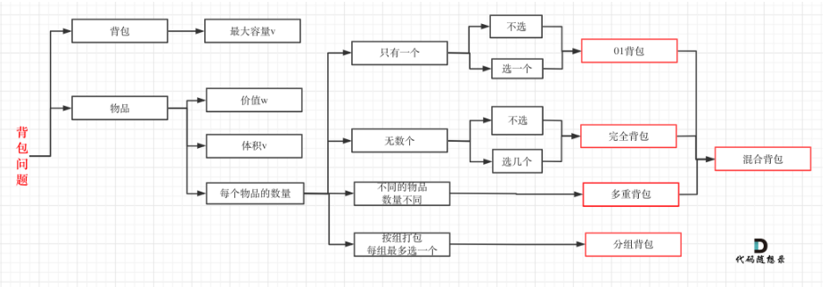
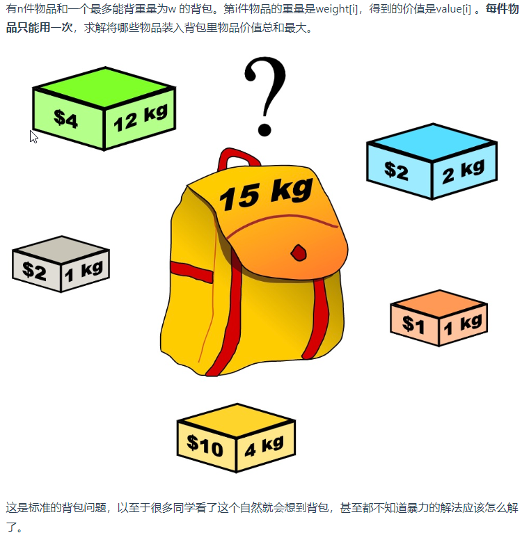

背包问题总分为

- 0-1背包
- 完全背包
- 多重背包

针对面试，前面两个`0-1背包`和`完全背包`掌握即可, 所有我也只学习关于前两个知识点



（图片截图自https://programmercarl.com/%E8%83%8C%E5%8C%85%E7%90%86%E8%AE%BA%E5%9F%BA%E7%A1%8001%E8%83%8C%E5%8C%85-1.html#_01-%E8%83%8C%E5%8C%85）


### 0-1背包



> 1. 确定dp数组（dp table）以及下标的含义
> 2. 确定递推公式
> 3. dp数组如何初始化
> 4. 确定遍历顺序
> 5. 举例推导dp数组

#### 二维dp数组解法

`step1`dp\[i][j]的二维数组   代表从重量0-i的石头中放入 容量为j的背包时  最大的价值

`step2`dp\[i][j] = max(dp\[i-1][j], dp\[i-1][j-curWeight]+curValue)

当前i个石头放入j容量的背包最大价值 = max{不选当前石头， 选当前石头价值 + (上一个i-1的石头中 放入**j-当前石头重量**的最大价值)}

`step3` 1. 初始 dp\[i][0] 即所有石头都不选 肯定为0

2. dp\[0][j]都为 value[0]（j >= 最小石头的重量）

`step4` 第一层循环：从第2个石头开始遍历每个石头 

第二层循环：从重量1开始遍历每个容量的背包的最大价值

```go
package main

import "fmt"

func main() {
	weight := []int{1,3,4}
	value := []int{15,20,30}
	bagWeight := 4
	maxValue := getMaxValue(weight, value, bagWeight)
	fmt.Println("maxValue is ",maxValue)
}

func getMaxValue(weight, value []int, bagWeight int) int {
	//初始化
	stonNum := len(weight)
	//初始dp二维数组  
	dp := make([][]int, stonNum)
	for i:=0; i<stonNum; i++ {
		dp[i] = make([]int, bagWeight+1)
	}

	//初始dp顶部
	for i:=weight[0]; i<=bagWeight; i++ {
		dp[0][i] = value[0]
	}


	//从第二个石头开始遍历
	for curSton:=1; curSton<stonNum; curSton++ {
		//遍历背包从[当前石头重量-bagWeight]的每个情况下最大价值
		for curBagWeight:=weight[curSton]; curBagWeight<=bagWeight; curBagWeight++ {
			LastStonValue := dp[curSton-1][curBagWeight] //前面石头同等背包容量下的最大价值
			LastStonSumCurStonValue := value[curSton] + dp[curSton-1][curBagWeight - weight[curSton]] //前面石头减去当前石头重量情况下 在加上当前石头价值 的最大价值
			dp[curSton][curBagWeight] = max(LastStonValue, LastStonSumCurStonValue)
		}
	}

	return dp[stonNum-1][bagWeight]
}

func max(p1, p2 int) int {
	if p1 < p2 {
		return p2
	}

	return p1
}
```

#### 滚动一维dp数组

