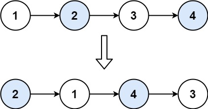

## [24. 两两交换链表中的节点](https://leetcode.cn/problems/swap-nodes-in-pairs/)

### 题目描述

> 给你一个链表，两两交换其中相邻的节点，并返回交换后链表的头节点。你必须在不修改节点内部的值的情况下完成本题（即，只能进行节点交换）。
>
>  
>
> 示例 1：
>
> 输入：head = [1,2,3,4]
> 输出：[2,1,4,3]
> 示例 2：
>
> 输入：head = []
> 输出：[]
> 示例 3：
>
> 输入：head = [1]
> 输出：[1]
>
>
> 提示：
>
> 链表中节点的数目在范围 [0, 100] 内
> 0 <= Node.val <= 100
>
> 来源：力扣（LeetCode）
> 链接：https://leetcode.cn/problems/swap-nodes-in-pairs

### 解题步骤

1. 常规两个为一组翻转节点指向
2. 翻转后的头结点需要和前面节点进行连接更新(prev记录前面节点)
3. 返回翻转后的头结点(虚拟头结点)

上面2、3点，先初始一个默认prev节点 每次节点更新后prev更新为当前节点， 第一次更新时 再用一个变量将初始prev地址记住，在首次更新后 这个变量的next即为返回的头结点

### 代码如下

```golang
/**
 * Definition for singly-linked list.
 * type ListNode struct {
 *     Val int
 *     Next *ListNode
 * }
 */
func swapPairs(head *ListNode) *ListNode {
    if head == nil || head.Next == nil {
        return head
    }
    cur := head
    prev := &ListNode{}
    ret := prev  //虚拟头结点
    for cur != nil && cur.Next != nil {
        tmp := cur.Next
        cur.Next = cur.Next.Next //交换当前节点和下一个节点指向
        tmp.Next = cur
        prev.Next = tmp //前面节点的Next指向直到当前交换后的头结点
        prev = cur //更新前面节点
        cur = cur.Next //更新遍历的节点
    }
    return ret.Next
}
```

时间复杂度：O(n)

空间复杂度：O(1)