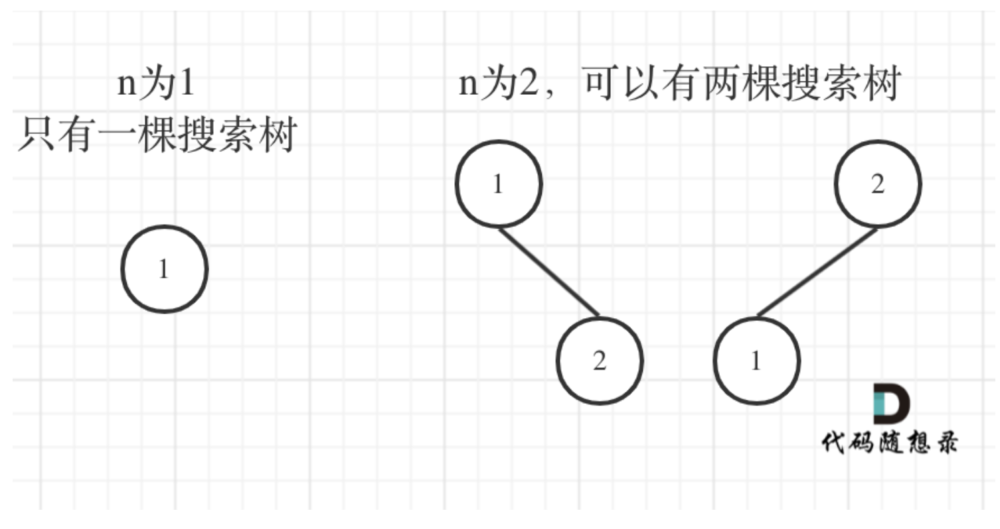
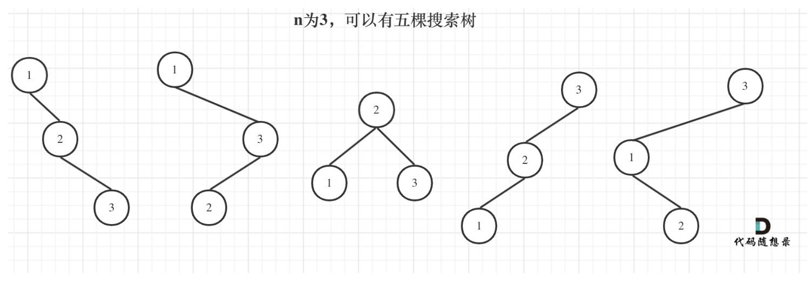

#### [96. 不同的二叉搜索树](https://leetcode.cn/problems/unique-binary-search-trees/)


>1. 确定dp数组（dp table）以及下标的含义
>2. 确定递推公式
>3. dp数组如何初始化
>4. 确定遍历顺序
>5. 举例推导dp数组

`Step1`: 明显这题用一维数组即可完成

那么这里我们需要得出dp[i]的含义即可  dp[n]意味着结果  那么dp[i]意味着节点数为i的情况下能组成的二叉搜索树个数

`step2`:需要确定递推公式了, 这里我偷个懒，用下carl的解题思路





可以发现：以n=3举例   

> dp[3] = dp[3-1]\*dp[0] + dp[2-1]\*dp[1] + dp[1-1]*dp[3]
>
> ​           = sum((三个节点属于根节点和左子树)-1为左子树的种类) * sum(0个节点属于右子树的种类) + sum(两个节点属于根节点和左子树)-1为左子树的种类)*sum(1个节点属于右子树的种类)) + sum(一个节点属于根节点和左子树)-1为左子树的种类)\*sum(两个节点属于右子树的种类)) 
>
>
> 此时我们可以遍历节点从1->n时对应的各个种类数  在遍历到i时  我们的左子树和根节点的数再从1->i开始遍历以j命名
>
> 有了**dp[i] += dp[j-1]\*dp[i-j]**

`step3`dp[0] = 1  0个节点种类为1   (不然dp[0]乘任何数为0了  后面结果有问题了)

`step4`从step2里 得知嵌套两层循环 一层遍历当前n节点数  一层声明当前左节点和根节点数量

`step5`以n=3为例  计算结果 是否符合预期


```go
func numTrees(n int) int {
    dp := make([]int, n+1)
    dp[0] = 1

    for i:=1; i<=n; i++ { //遍历总节点数 从1->n
        for j:=1; j<=i; j++ { //当前左节点+根节点数 从1->n
          dp[i] += dp[j-1] * dp[i-j] //当前总结点n的种类 += j-1(左子树) * i-j(剩余节点在右树上)
        }
    }

    return dp[n]
}
```

附录

https://programmercarl.com/0096.%E4%B8%8D%E5%90%8C%E7%9A%84%E4%BA%8C%E5%8F%89%E6%90%9C%E7%B4%A2%E6%A0%91.html#%E6%80%9D%E8%B7%AF