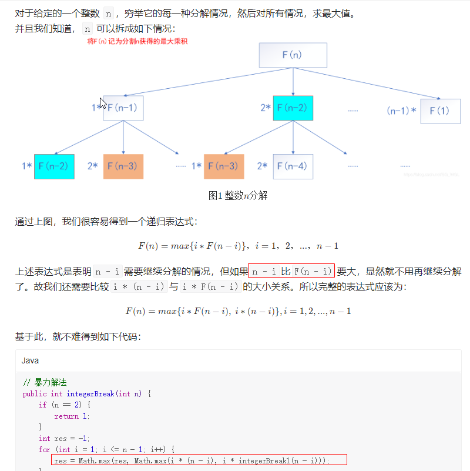

#### [343. 整数拆分](https://leetcode.cn/problems/integer-break/)

> 1. 按照下面思路得出：`F(n) = max{i*F(n-i), i*(n-i)}, i=1,2,3...,n-1`
>
> 2. 剪枝(备忘录)重复f(n)用memo存起来
>
>
> 换个思路就是 n=10时  我们从1开始计算最大乘积  到5的时候  计算max{(5-1)*1, (5-3)\*3,....}而 其中的3又可以再分 这里我们用memory记录下， 比较max{(5-3)\*3,memo[3]\**(5-3)} 



```go
func integerBreak(n int) int {
	memory := make(map[int]int, n+1)
	memory[2] = 1
	
	for i:=3; i<=n; i++ {
		for j :=1; j<i; j++ {
			memory[i] = max(memory[i], max(j*(i-j), j*memory[i-j]))
		}
	}

	return memory[n]
}

func max(p1, p2 int) int {
	if p1 < p2 {
		return p2
	}

	return p1
}
```

附录

https://leetcode.cn/problems/integer-break/solution/bao-li-sou-suo-ji-yi-hua-sou-suo-dong-tai-gui-hua-/

