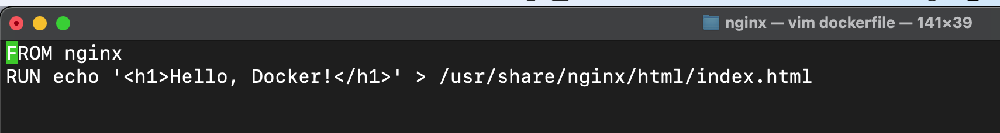
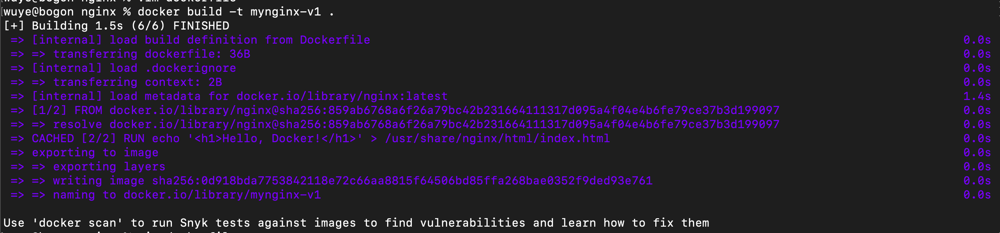
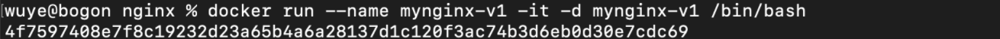
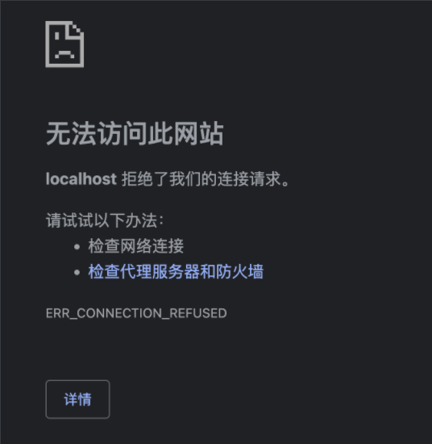
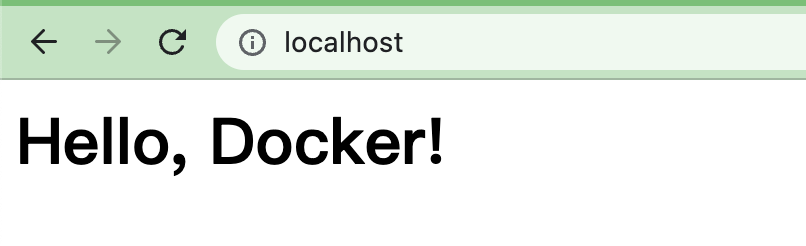

# 通过dockerfile 制定自己的容器

1. 在某个本机路径下创建dockerfile文件

2. vim dockerfile(以nginx为例)

   `FROM nginx`

   `RUN echo '<h1>Hello, Docker!</h1>' > /usr/share/nginx/html/index.html`

   

3. 我们通过`docker build -t mynginx-v1 .`构建出mynginx-v1的镜像(image)	

此时docker/images中就有了我们创建镜像，后面进阶的话，我们可以在dockerfile里加一些其他的依赖库或者其他的配置，后面再慢慢学习记录

4. 生成容器实例通过3.的镜像`docker run --name mynginx-v1 -it -d mynginx-v1 /bin/bash`

5. 试着访问下localhost，不出意外的话页面会输出"Hello, Docker!", 因为我们在2.中设置了默认页面

还是出了意外, ······ 1h后， 经过我查看容器中的nginx.conf以及 conf.d/*.conf都没有发现问题, 最后[这个老兄的博客解救了我](https://blog.csdn.net/qq_29645505/article/details/92853770#:~:text=%E8%8C%83%E5%9B%B4%EF%BC%9Adocker%E5%AE%B9%E5%99%A8%E6%AD%A5%E9%AA%A4%E4%B8%80,%E8%AF%B7%E5%85%88%E5%AE%89%E8%A3%85%E4%B8%8Bcurl%E3%80%82)

5.1 我们先关闭当前的v1 容器， 重新run一个 `docker run --name mynginx-v2 -it -p 80:80 -d mynginx-v1`

较之前加了`-p 80:80`

5.2 重试一下 localhost

至此，我们完成了这人类一小步，个人一大步的阶段性胜利，我们可以通过dockerfile来部署/更新docker容器实例了

学习地址:https://yeasy.gitbook.io/docker_practice/image/build