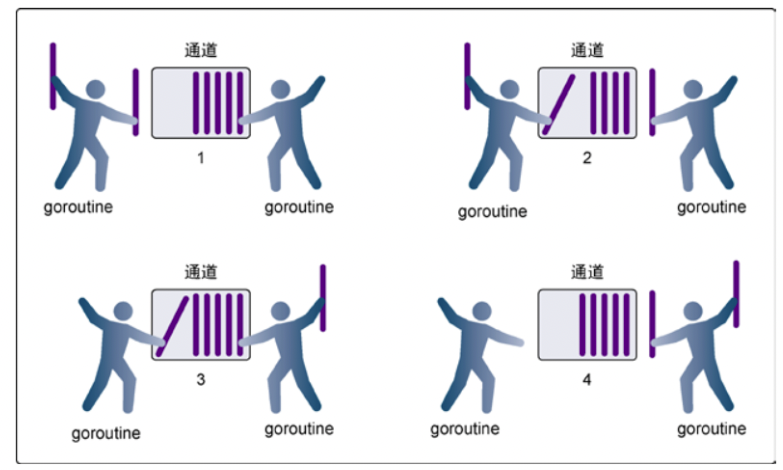

#### CSP: 不要通过共享内存来通信，而要通过通信来实现内存共享，它是 Go 的并发哲学，基于 channel 实现。

> 1. 对一个关闭的通道再发送值会导致panic(panic是什么？)
> 2. 对一个关闭的通道进行接收会一直获取值直到通道为空
> 3. 关闭一个已经关闭的通道会导致panic

### 无缓冲通道


无缓冲通道必须有接收的即 生成和消费 是一对出现的  否则会deadlock

### 有缓存通道



### chan相关命令

> 1. select{} 管道的Switch case
>
> 2. ch <- 1 发送
>
> 3. <-ch  接收
> 4. close(ch) 关闭通道


```go
package main

import "fmt"

func main() {
	ch1 := make(chan int)
	ch2 := make(chan int)

	go func() {
		for i := 0; i <= 100; i++ {
			ch1 <- i
		}
		close(ch1)
	}()

	go func() {
		for {
			i, ok := <-ch1 //ch1通道关闭后跳出
			if !ok {
				break
			}
			ch2 <- i * i
		}
		close(ch2)
	}()

	for i := range ch2 { //ch2通道关闭后还会取值 直到没有值之后退出
		fmt.Println(i)
	}
}

```


附录：

https://www.topgoer.com/%E5%B9%B6%E5%8F%91%E7%BC%96%E7%A8%8B/channel.html#channel
>>>>>>> 8281125fcf05c7571a6e11fe57d0234bc8a4645f
