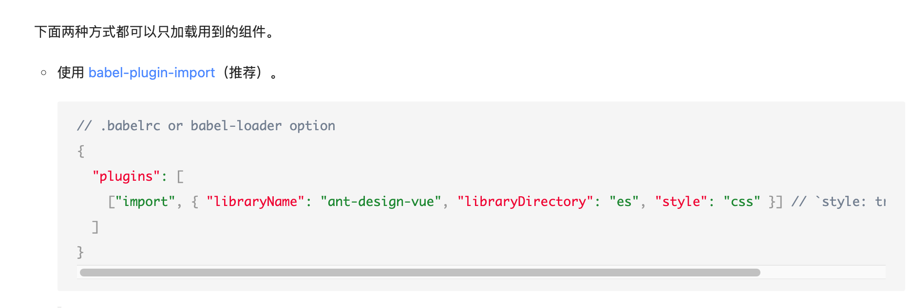
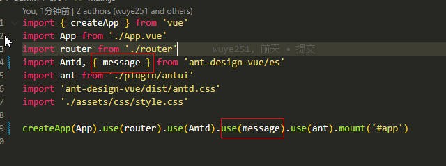
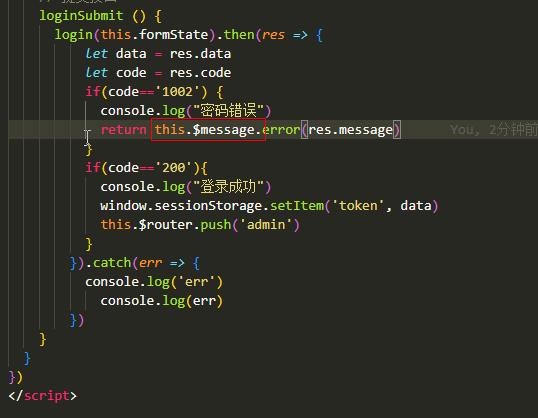
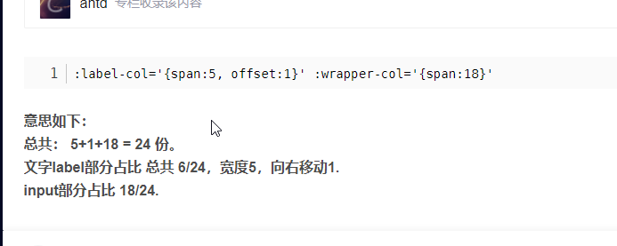
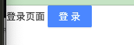
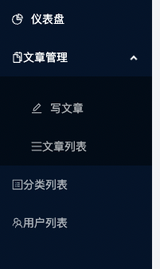

Section1： 后端配置  gin路由、config配置

> [配置文件工具go-ini](https://ini.unknwon.io/docs/intro/getting_started)

Section2: [gorm使用](https://gorm.io/index.html)

SECTION2： 创建controller接口 、路由  

SECTION3: 编写查找用户、添加用户 接口

>1. ShouldBindJSON / Query(Key)
>2. c.JSON
>3. gin.H
>4. gorm {select, insert}

SECTION4：用户密码加密(bcrypt, scrypt)

好文https://astaxie.gitbooks.io/build-web-application-with-golang/content/zh/09.5.html

SECTION5: 更新用户，删除用户

> 1. gorm {delete软删除}
> 2. gin   c.Param c.Query  的区别是什么  获取入参 
>    1. Param是在路由里设置uri/:id   实际postman传输的uri/123   代码获取时用c.Param("id") = 123
>    2. c.Query是在路由里设置uri  实际postman传世的uri?query(如id=3&limit=10) 代码获取时用c.Query("id") = 3
>    3. shouldBindJSON是post用body获取的

SECTION6:博客增删改查

> 1. Preload 模型关联 看看别的吧

Section7: jwt实现

> [jwt 包实现登录](https://pkg.go.dev/github.com/dgrijalva/jwt-go/v4)

Section8: 登录接口添加、 中间件加在route

> 1. route.Use(middleware.func()) 就实现使用中间件了

Section9:上传服务

> 1. Require 到go.mo  然后命令行go mod download/ go mod tidy就可以直到版本下载？
> 2. 七牛对象存储

Section10: 日志系统

> 1. github.com/sirupsen/logrus
> 2. 日志分割 github.com/lestrrat-go/file-rotatelogs、github.com/rifflock/lfshook

Section11: validate&&跨域

> 1. vaildate验证 model加标签  创建utils.validate文件进行验证
>    1. 英文转中文
>    2. 字段英文转中文model加label标签
> 2. 跨域+列表count数

### 后端接口完成=========


section1: 前端框架初始

> 1. Vue、 yarn、nodejs是干嘛的 了解一下
>
> 2. 初始化项目
>
>    1. vue create admin
>
>       1. Router 2.0(应该用3.0的)
>
>    2. Ant design vue
>
>       1. 安装 yarn add ant-design-vue --dev
>       2. 配置按需加载https://www.antdv.com/docs/vue/introduce-cn
>
>       
>
>       3. 安装yarn add axios
>       4. yarn add babel-plugin-import --dev
>       6. yarn serve
>
>    Route/index.js相当于路由  引入views每个vue后就可以加载对于页面
>
> 3. vue2和vue3语法的差异 导致搞了两天才弄完   回头看看vue3的东西  没有理论基础 不好整呀
>
> 4. 全局变量在 main.js里声明 然后use即可
>
> 
>
> 
>
> tips: message是否可以以其他方式声明全局变量

section 2: 

> 1. vue router
> 2. antdv 做页面布局
> 3. 致富给的设置token、删除token
> 4. 子路由是怎么跳转的  route.push只给了path 就可以跳?

<font color=red>出现的问题：</font> 

> 1. category、user、article都在一个model包下   按照之前的喜欢命名 insert 、getById 会重复  目前只能每个方法后加上Category、user的后缀  有没有更好的办法解决
>
> 2. retrun 抽离公共方法返回  code、msg、data为参数
>
> 3. 入参加日志、 sql加日志 
>
> 4. context
>
> 5. 跨域理解（阮一峰)
6. Vue、 yarn、nodejs是干嘛的 了解一下
> 7. antd 中 :wrapper-col
> 8. 
>
> 6. Vue、 yarn、nodejs是干嘛的 了解一下
>
> 7. vue2和vue3语法的差异 导致搞了两天才弄完   回头看看vue3的东西  没有理论基础 不好整呀
>
> 8. a-button是什么
>
>    ```vue
>   <template>
>        <div>
>           登录页面
>        <a-button type="primary">登录</a-button>
>        </div>
>    </template>
>
>    ```
> 
>    
> 
> 9. vue router 前置守卫  未登录重定向
> 10. antdv layout做页面布局
> 11. export default defineComponent({
>     methods: {
>         logout() {
>             console.log('logout event')
>             removeToken()
>             this.$router.push('/login')
>         }
>     }
> })啥意思



- 打包优化 
  - cdnhttps://juejin.cn/post/6844903850084663309
  - 分析软件 https://juejin.cn/post/6844904056985485320
  - 组件拆分(全局组件 拆分为按需引入)
