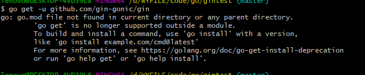

1. 创建并初始一个 多类型的map数组

```go
//interface{}指的是多类型的
//{"bookId":123}指的是初始化
curResult := map[string]interface{}{"bookId": curBookId, "page": curPageId, "xmlNum": xmlNum}
```

2. go mod是干嘛的  go get是干嘛的  为什么go get前不初始化mod 会报错  相比较 go install又是干啥的




在我初始一个项目时候，操作顺序如下:

> //不在GOPATH路径下， 并且[set GO111MODULE=on](https://www.cnblogs.com/l199616j/p/15269281.html)
>
> 1. mkdir xxx && cd xxx
> 2. go init mod gintest (init mod)
> 3. go mod tidy (what is this)
> 4. go run main.go
> 5. success
>
> - 当我省略了step2时， `main.go:6:2: no required module provides package github.com/gin-gonic/gin: go.mod file not found in current directory or any parent directory; see 'go help modules'`意思是在当前xxx路径下未找到包含gin-goinc包的go.mod 原因是我set GO111MODULE=on  并且少了第二步，
> - 当我加上step2，未执行step3时，`main.go:6:2: no required module provides package github.com/gin-gonic/gin; to add it:
>           go get github.com/gin-gonic/gin` go.mod 未包含这个gin-goinc包  说明step3是将包引入或者加载到go.mod里 

- go mod 每个项目都有对应的一个包名，提交后别人想用可以拉你这个包名使用， 所以都需要初始化的
- go get 分为2步
  - 下载源码以及相关依赖到 gopath/pkg
  - (如果可以编译为可执行程序) 编译放到gopath/bin下
- go install 编译到gopath/bin下

3. 