> 1. 演变历史
>
>    - 串行
>    - 多进程/多线程
>    - 协程
>      - 用户态 持有协程
>      - 内核态分配线程
>
> 2. 协程(用户态)和线程(内核态)的对应关系
>
>    - 1:1
>
>    - n:1
>
>    - n:m
>
> 3.  goroutine + channel 实现并发
>
> 4. 调度器
>
>    - 废弃的调度器GM模型
>    - 当前的GMP模型
>      - G - 用户态线程， 不存储系统分配资源相关东西，仅有几KB 较线程小， 切换代价小
>        - G的几个状态
>          - waiting
>          - runnable
>          - running
>      - M -  thread 和系统资源CPU绑定的核心态线程， maxprocess概念   表示最大并发数
>      - P -   process  G和M之间的中间层， 可以通过P将其维护的本地队列中的G分配给M进行执行
>      - 全局队列 - 在多个P的本地队列上，又有全局队列， 如果P中的本地队列空可以从全局队列中拉取G 进行处理， 同样的如果P维护的本地队列满了之后， 会将本地队列中一半的G追加到全局队列
>      - P对应的本地队列， 每个P维护一个本地队列，
>      - M线程执行任务得需要获取P处理器,  先从P的本地队列，  空则全局队列拿 或者其他P的本地队列偷取
>    - 策略
>      - work  stealing  线程无G可执行时  偷取其他队列任务  而不是销毁线程  达到复用目的
>      - hand off 当前G系统调用阻塞时， 线程释放P，让P找空闲线程绑定执行
>      - 最多有GOMAXPROCS个线程 同时在多个CPU上执行，达到并行
>      - 抢占式：分配时长由操作系统控制， goroutinue每个协程最多占用CPU10ms，防止其他Goroutine饿死

## 简介

g：goroutine

m：thread 线程

p：process处理器

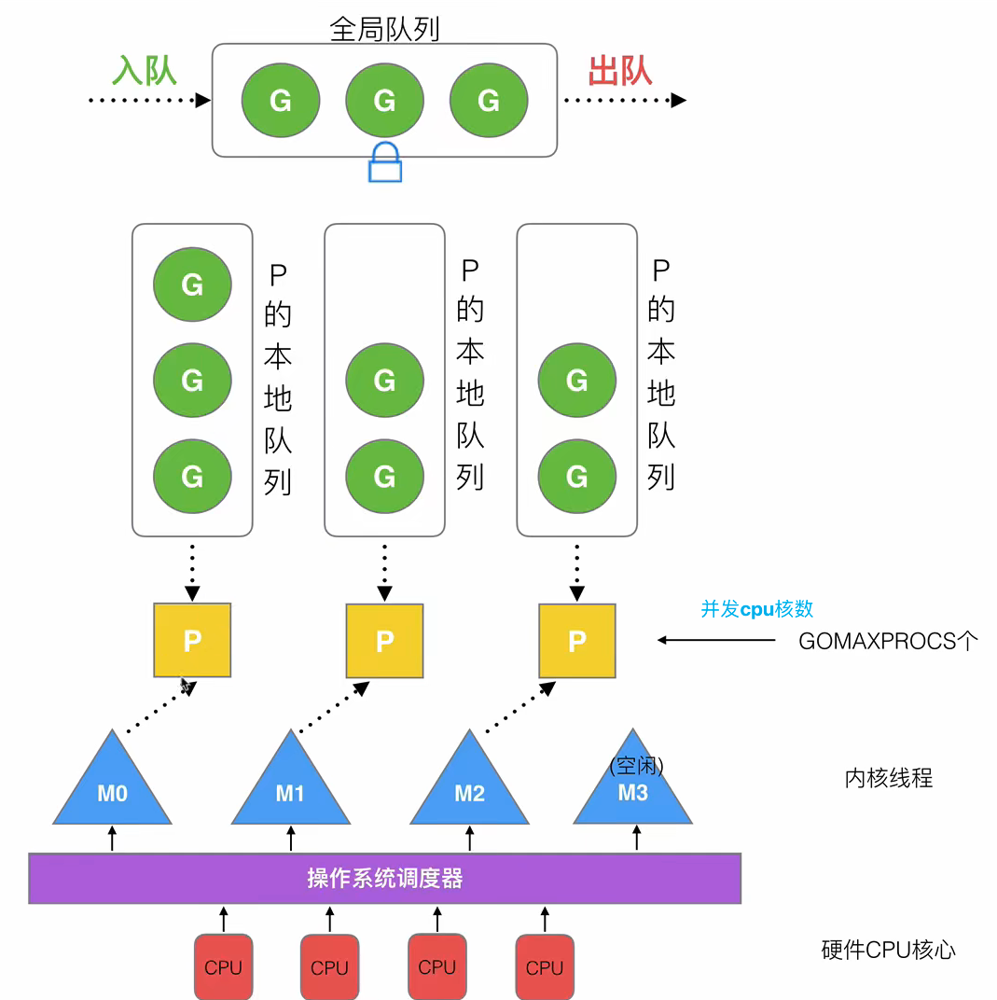

- 创建的goroutine需要通过process绑定thread才能在cpu上运行
- 存储goroutine有本地队列和全局队列，本地队列和p一一对应
- 同一时间最大的并行数量等于gomaxprocs 即p的数量

## 调度器策略

### 复用线程

> 避免频繁的创建/销毁线程带来的额外开销，对线程进行复用

#### work stealing

> 当本地队列无Goroutine可执行时，会偷取其他本地队列的G，而不是销毁当前本地队列绑定的线程

#### hand off

> 因当前Goroutine阻塞时，会创建/唤醒新的线程和P进行绑定， 当前阻塞的G和M继续阻塞

### 利用并行

多个P绑定多个M，可以由多个CPU并行进行处理

### 抢占机制

某个G在CPU的最多执行时长为xms，超过时长后其他G可抢占CPU资源

### 全局G队列  

work stealing 本地队列/其他本地队列都为空时，会从全局队列获取

## 调度流程

  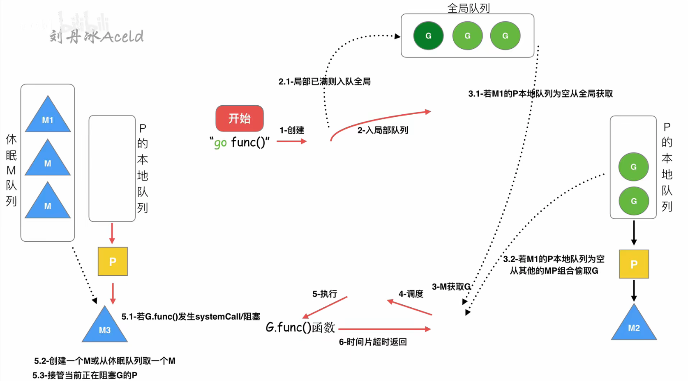

1. 新创建协程尝试插入本地队列，若本地队列满了则会插入全局队列
2. M获取G时
   1. 从绑定的P的本地队列获取，若为空，则尝试work stealing 其他本地队列
   2. 若无可执行的G，最后从全局队列获取G
3. M绑定G，在CPU执行，执行结束/达到最长时间片后从CPU释放
   1. G如果结束则会销毁，或者返回到本地队列， 如果本地队列满了则会插入全局队列
   2. G如果发生阻塞，则P和其本地队列，会寻找休眠M队列或创建新线程进行绑定， 当前阻塞G继续和原来的M进行绑定

## 其他

### 场景流程

#### 1. 初期的M0和G0

- M0---启动程序后编号为0的主线程
  - 负责执行初始化操作和启动第一个G
- G0 --- 每启动一个M，都会第一个创建的Goroutine
  - 用于调度的G
  - 不指向任何可执行的函数
  - 每个M都有一个自己的G0

#### 2. 连续创建过多G

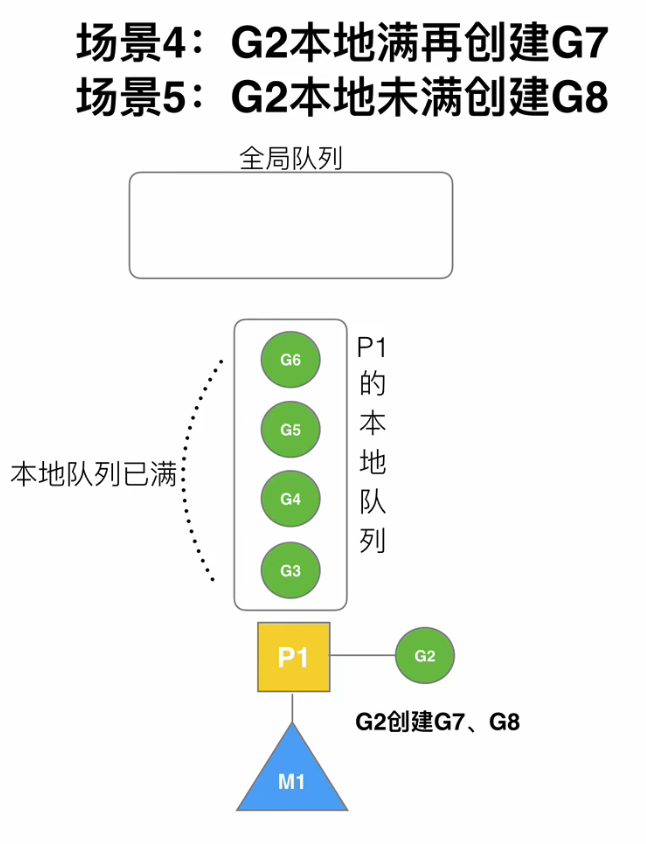

1. **局部性原理**，新创建的G优先加入到绑定的P的本地队列
2. 如果本地队列满了
   1. 拆分本地队列为1/2，将前面G3、G4打乱放到全局队列，G7也会放到全局队列
   2. G5、G6往前移动到本地队列头部，G8后续加到本地队列尾部

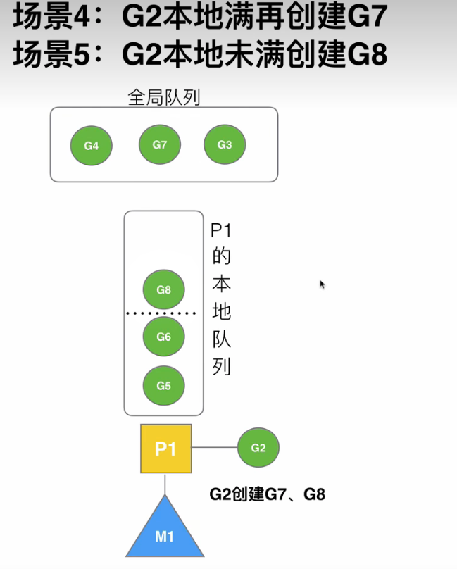

#### 3. 唤醒正在休眠的M

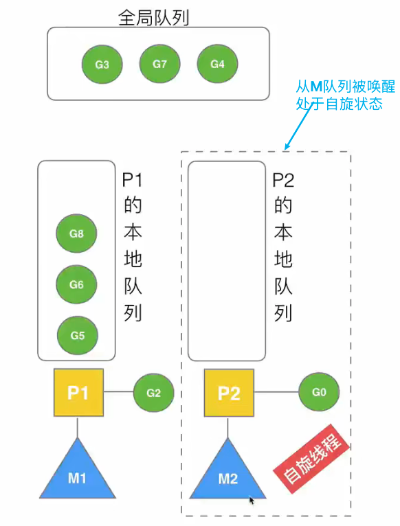

#### 4.被唤醒的M2从全局队列取批量的G

--- 负载均衡

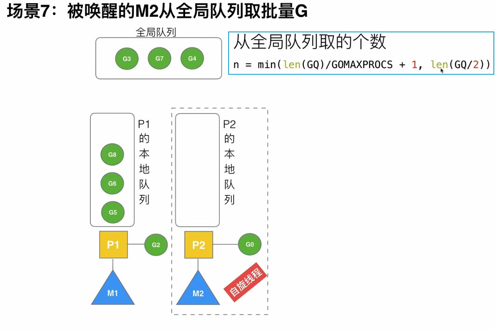

也可以从其他队列中偷取，/2之后的后半部分全偷过来执行

#### 5. 自旋线程的最大限制

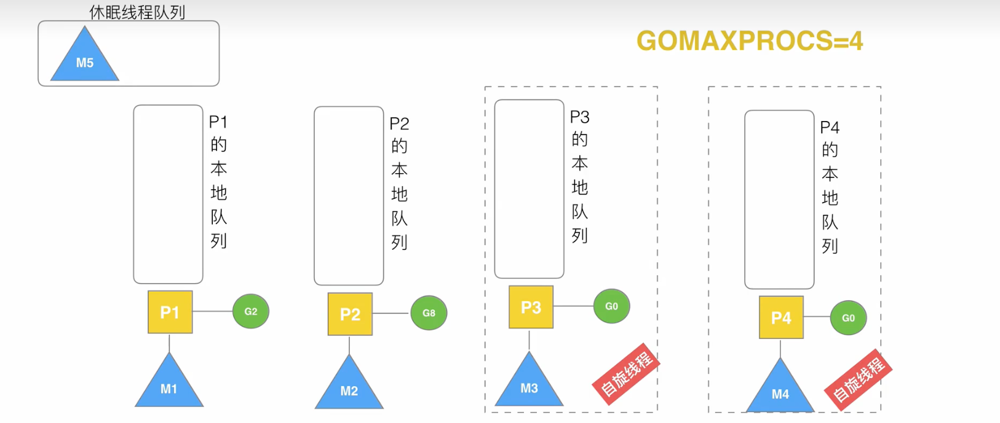

当前4个GMP线程，多余其他M线程后(阻塞的G执行完释放的M)会加入到休眠线程队列

#### 6. G发生调用阻塞

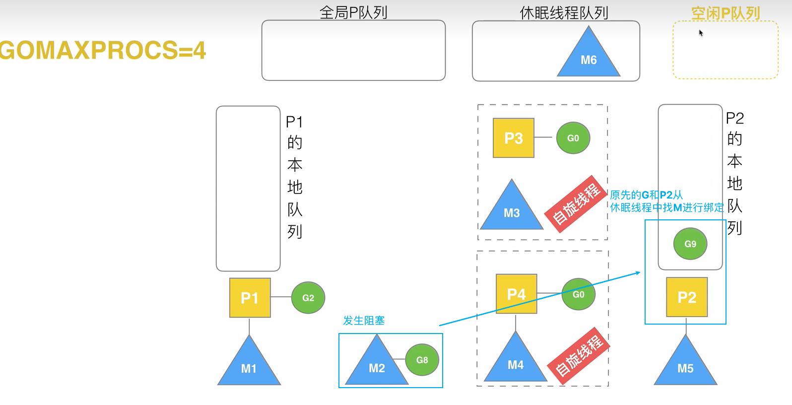

#### 7. G发生系统调用/非阻塞

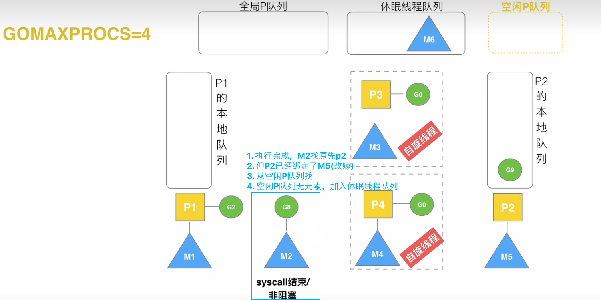

### 可视化GMP调试

```go
package main

import (
	"fmt"
	"os"
	"runtime/trace"
)

func main() {
	f, err := os.Create("trace.out")
	if err != nil {
		panic(err)
	}
	defer f.Close()

	err = trace.Start(f)
	if err != nil {
		panic(err)
	}

	fmt.Println("Hello gmp")

	trace.Stop()
}
```

`go tool trace trace.out`查看g、m、p还有heap的情况

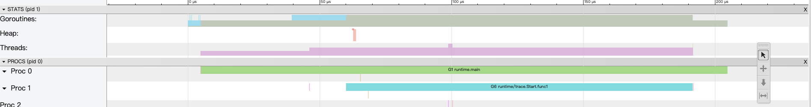

### GMP终端debug

```go
package main

import (
	"fmt"
	"time"
)

func main() {
	for i := 0; i <= 5; i++ {
		time.Sleep(1 * time.Second)
		fmt.Println("hello gmp")
	}
}
```

`GODEBUG=schedtrace=1000 ./main`

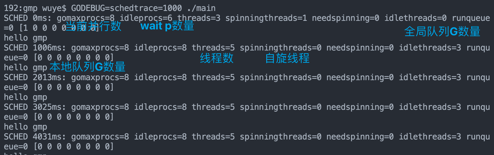


# 参考

- https://learnku.com/articles/41728#replies
- [大神全教程文章(附视频)](https://www.yuque.com/aceld/golang/srxd6d)
- https://cloud.tencent.com/developer/article/1839604