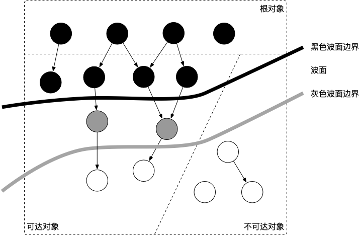

## 三色标记法

### 三色抽象

#### 白色对象(可能死亡)

> 未被回收器访问到的对象，指不可回收的意思

#### 灰色对象(波面)

> 被回收器访问到的对象，需要再对其扫描，因为可能指向白色对象

#### 黑色对象(确认存活)

> 被回收器访问到的对象，不可能指向白色对象

### 波面推进

参考：

https://golang.design/go-questions/memgc/principal/