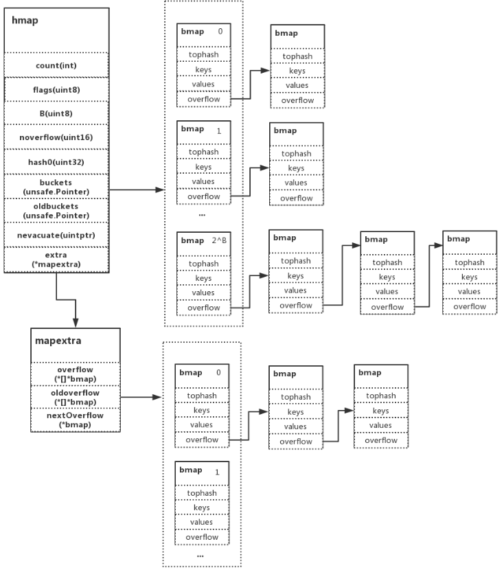

### 结构

```go
type hmap struct {
	count      int            // map 的大小，也就是 len() 的值。代指 map 中的键值对个数
	flags      uint8          // 状态标识，主要是 goroutine 写入和扩容机制的相关状态控制。并发读写的判断条件之一就是该值
	B          uint8          // 桶，最大可容纳的元素数量，值为 负载因子（默认 6.5） * 2 ^ B，是 2 的指数
	noverflow  uint16         // 溢出桶的数量
	hash0      uint32         // 哈希因子
	buckets    unsafe.Pointer // 保存当前桶数据的指针地址（指向一段连续的内存地址，主要存储键值对数据）
	oldbuckets unsafe.Pointer // 保存旧桶的指针地址
	nevacuate  uintptr        // 迁移进度
	extra      *struct {      // 原有 buckets 满载后，会发生扩容动作，在 Go 的机制中使用了增量扩容，如下为细项：
		overflow     *[]*bmap // overflow 为 hmap.buckets （当前）溢出桶的指针地址
		oldoverflow  *[]*bmap // oldoverflow 为 hmap.oldbuckets （旧）溢出桶的指针地址
		nextOverflow *bmap    // nextOverflow 为空闲溢出桶的指针地址
	}
}
```



- map无序遍历方法
  - key存在slice中
  - 将slice排序
  - 遍历排序后的slice 取当前的map key


### 附录

- [煎鱼-map](https://eddycjy.gitbook.io/golang/di-7-ke-shu-ju-jie-gou/map-access)

