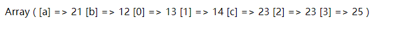

# array_merge和array+array的区别

- 参考

[array_merge文档](https://www.php.net/manual/zh/function.array-merge.php)

## array_merge

引自官方手册的说明：

> 如果输入的数组中有相同的字符串键名，则该键名后面的值将覆盖前一个值。然而，如果数组包含数字键名，后面的值将 *不会* 覆盖原来的值，而是附加到后面。
>
> 如果输入的数组存在以数字作为索引的内容，则这项内容的键名会以连续方式重新索引。

1. 字符串相同的，后面会覆盖前面
2. 数字索引，合并后会重置为连续的索引值

实践来证明下

```php
$arr1 = ['a' => 11, 'b' => 12, 3 => 13, 1 => 14];
$arr2 = ['a' => 21, 'c' => 23, 1 => 23, 2 => 25];
//上面的测试了1. 字符串相同时的合并规则('a'索引)
//2. 数字索引相同或不相同时， 合并后的情况 (1>arr1中索引3位于1前面 看看他们的位置是否有变化 2> arr1中索引1和arr2索引1相同)
$arr = array_merge($arr1, $arr2);
print_r($arr);
```

**结果：**



以上结果证明：

1. 字符串索引相同时， 后面数组会覆盖前面的
2. 数字索引， 不管有无相同的，都会顺序的访问，并重置为连续的索引(换句话来说，只要是数组索引，不管是否相同，不管索引大小，都按照顺序重置)

## array+array

>如果你想完全保留原有数组并只想新的数组附加到后面，可以使用 `+` 运算符：
>
>第一个数组的键名将会被保留。在两个数组中存在相同的键名时，第一个数组中的同键名的元素将会被保留，第二个数组中的元素将会被忽略。

1. 和array_merge不同的是， 索引(不区分数字或者字符)， 只要相同，就只保留第一个数组中的， 并且索引不会重置

给各位大佬递代码（只是把array_merge里的代码方法改为了`+`）

```php
$arr1 = ['a' => 11, 'b' => 12, 3 => 13, 1 => 14];
$arr2 = ['a' => 21, 'c' => 23, 1 => 23, 2 => 25];

//$arr = array_merge($arr1, $arr2);
$arr = $arr1+$arr2;
print_r($arr);
```

**结果：**


## 总结

array_merge更高级，array`+`array更简单

1. 字符串索引相同array_merge后面覆盖前面
2. 数字索引 array_merge会将其全部重置

相比较`+`， 只要后面和前面相同的，我都不覆盖


看到这儿了，不再看看常用数组有哪些？给客官上茶https://www.php.net/manual/zh/book.array.php