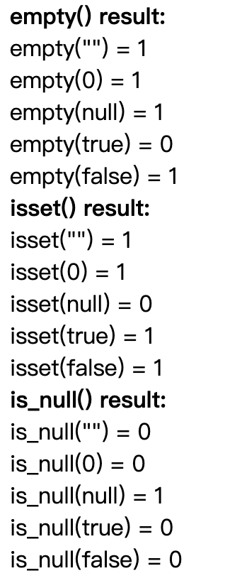

# empty() and isset() and is_null() different

先上结果图：



谈自己理解：

1. isset在值为null或未声明情况下,都是fasle，其余情况都是true(0、""等都是true)
2. Is_null只有在值为null时， 返回true

下面放上代码，可以自己试试

```php
<?php

$var1 = "";
$var2 = 0;
$var3 = null;
$var4 = true;
$var5 = false;

echo "<strong>empty() result:</strong><br>";
print('empty("") = '.intval(empty($var1))); //true
echo "<br>";
print('empty(0) = '.intval(empty($var2))); //true
echo "<br>";
print('empty(null) = '.intval(empty($var3))); //true
echo "<br>";
print('empty(true) = '.intval(empty($var4))); //flase
echo "<br>";
print('empty(false) = '.intval(empty($var5))); //true
echo "<br>";
echo "<strong>isset() result:</strong><br>";
print('isset("") = '.intval(isset($var1))); //true
echo "<br>";
print('isset(0) = '.intval(isset($var2))); //true
echo "<br>";
print('isset(null) = '.intval(isset($var3))); //false
echo "<br>";
print('isset(true) = '.intval(isset($var4))); //true
echo "<br>";
print('isset(false) = '.intval(isset($var5))); //true
echo "<br>";
echo "<strong>is_null() result:</strong><br>";
print('is_null("") = '.intval(is_null($var1))); //false
echo "<br>";
print('is_null(0) = '.intval(is_null($var2))); //false
echo "<br>";
print('is_null(null) = '.intval(is_null($var3))); //true
echo "<br>";
print('is_null(true) = '.intval(is_null($var4))); //false
echo "<br>";
print('is_null(false) = '.intval(is_null($var5))); //false
echo "<br>";
```

参考：

- https://phppot.com/php/isset-vs-empty-vs-is_null/#top
