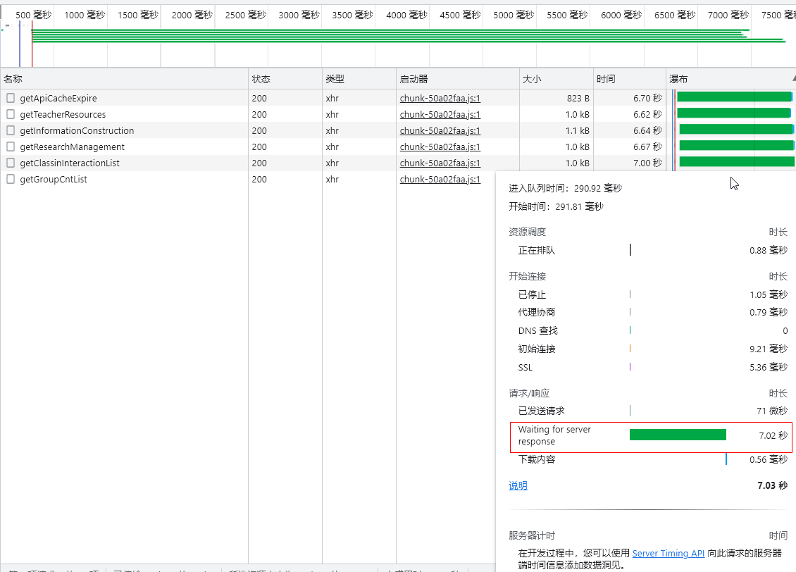
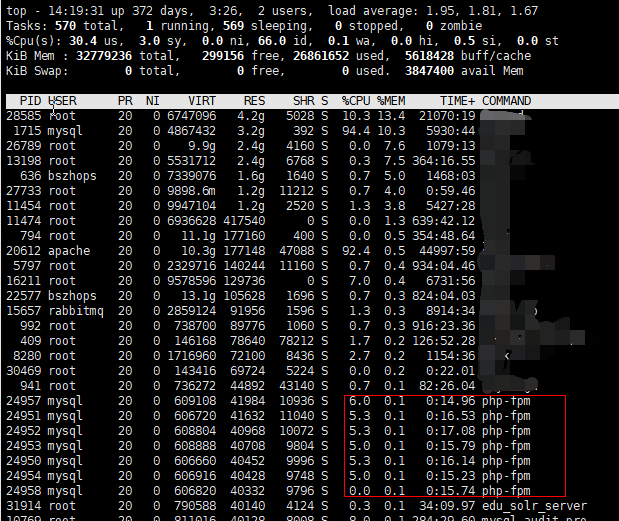
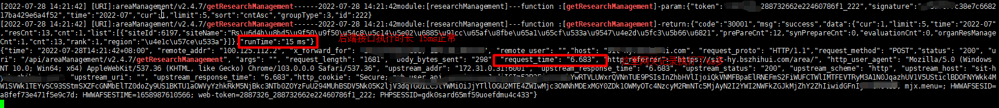
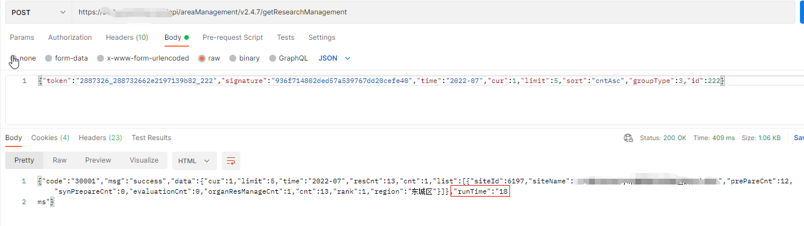
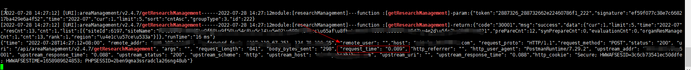
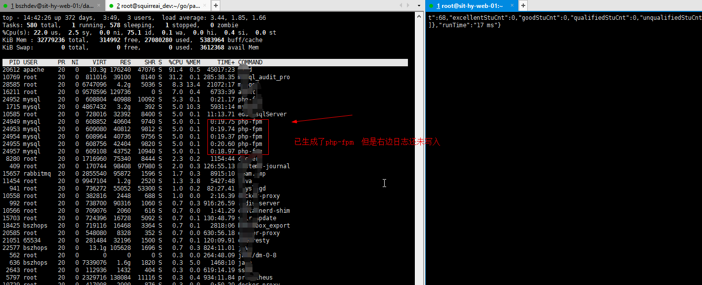
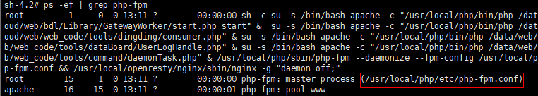

1. 谷歌请求时间分析     

   

   1.1  进入队列  -> 开始执行时长
   1.2  发送请求时长
   1.3  等待response  时长    ！！！

           1.  服务器负载    内存、cpu均正常 通过top查看    正常！
           
           
               
               2. 后端代码    日志执行12ms    正常！
               
               
               
                  3. 网关apisix  执行6s    不正常！！！
               
                        - postman执行没问题
               
                        
               
                        
               
                  4.  网页请求出问题(前端并发请求数越多  响应越慢)
               
                        > 查了半天， 频率限制等设置均没有限制， 再观察下  并发越多，执行越慢， top、php日志同时看时， 发现php-fpm已经创建  但是请求日志还未写入， 发现是php-fpm里面有额外的操作，可能导致了变慢的问题
               
                        
               
                        5. 那就尝试看看php-fpm干了什么，导致变慢了
               
                           

- 參考

  - https://juejin.cn/post/7045274658798567454
  - [php-fpm开启慢日志](https://www.getpagespeed.com/server-setup/how-to-log-and-fix-slow-php-requests)

  - [php优化](https://www.ucloud.cn/yun/10639.html)