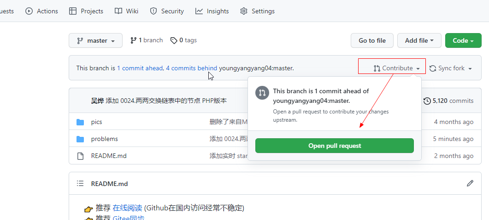
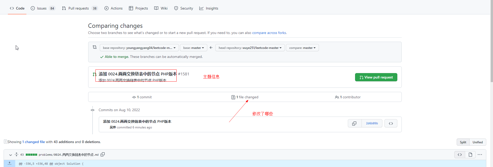

https://chinese.freecodecamp.org/news/how-to-make-your-first-pull-request-on-github/

1. 点击仓库进行fork
2. clone  fork后的仓库
3. git remote add upstream 开源项目地址
4. 进行修改
5. git push `origin`  main-branch 先提交到自己仓库
6.   

7. 